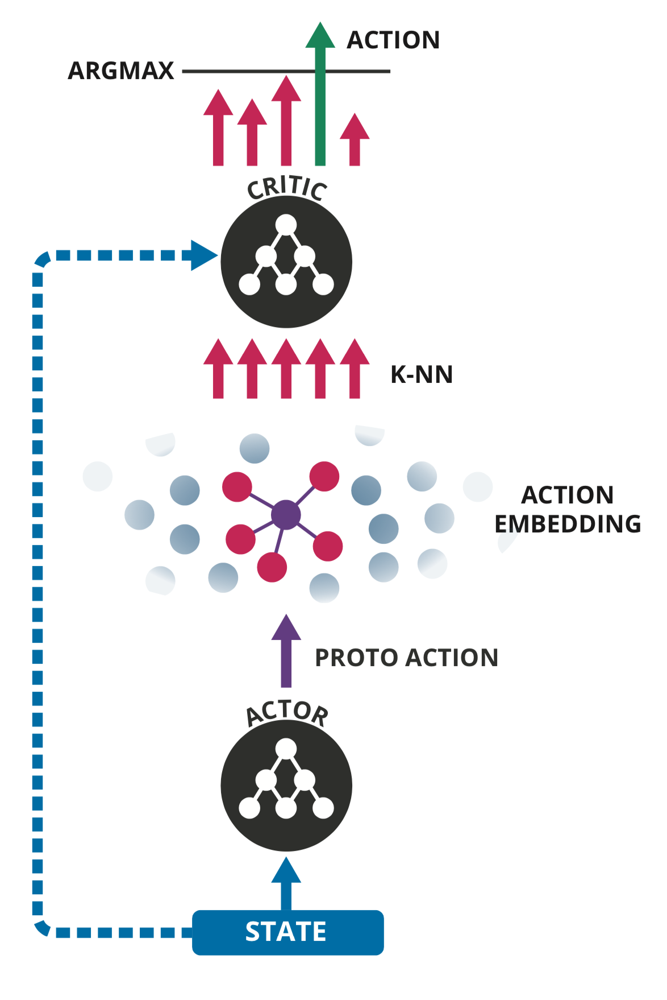
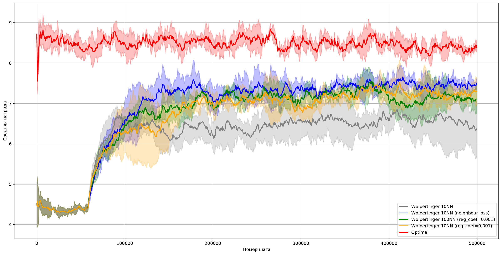

# Wolpertinger recommendations
Реализация статьи [Deep Reinforcement Learning in Large Discrete Action Spaces](https://arxiv.org/abs/1512.07679)
 для рекомендаций

   

К реализации алгоритма из статьи добавлена регуляризации критика по ближайшему соседу протодействия.
В экспериментах это дало чуть лучшие результаты.

   

На основе этого проекта была выполнена моя [курсовая работа](https://github.com/pkorobov/wolpertinger-recommendations/blob/master/course_work/course_work.pdf), где подробно описан симулятор для агента и результаты экспериментов.
